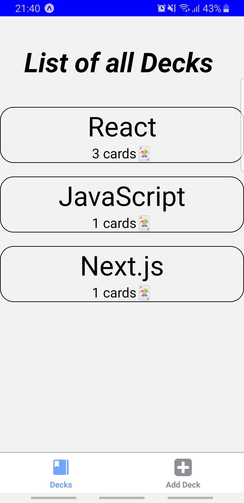

# Project Description
this is the third react  nanodegree project, a mobile flashCard created with react native

   
   
   

   
   
    

   

# Installation
Clone the repository, change directories, and use npm or yarn to install the dependencies.
<code>

$ git clone https://github.com/BennaceurHichem/mobile_flasCard_project/new/master?readme=1

$ cd mobile_flasCard_project

$ npm install `

$ expo start // or npm start

</code>

This will open Expo Developer Tools in the browser. You can then do one of the following.
Use your device to test:
<ul>

<li>Scan the QR Code using the Expo Client app (Expo Client for Android & iOS) from an Android or iOS device.
 or </li>
<li>or click on android/ios emulator</li>
</ul>

# Testing
This project has been tested on the following platforms:
iOS 11+
Android 9+.

